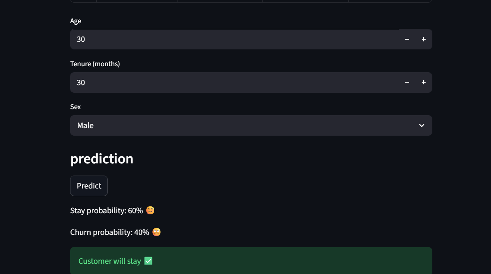
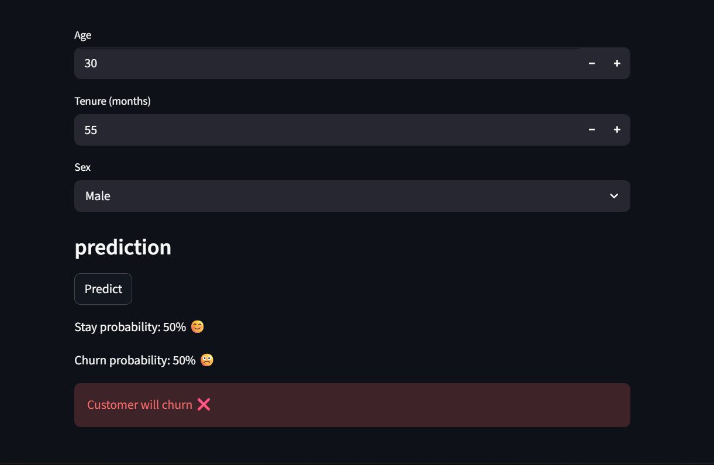
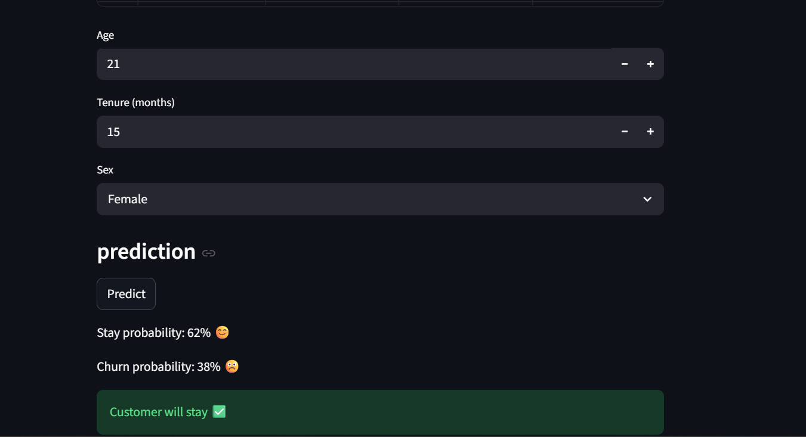
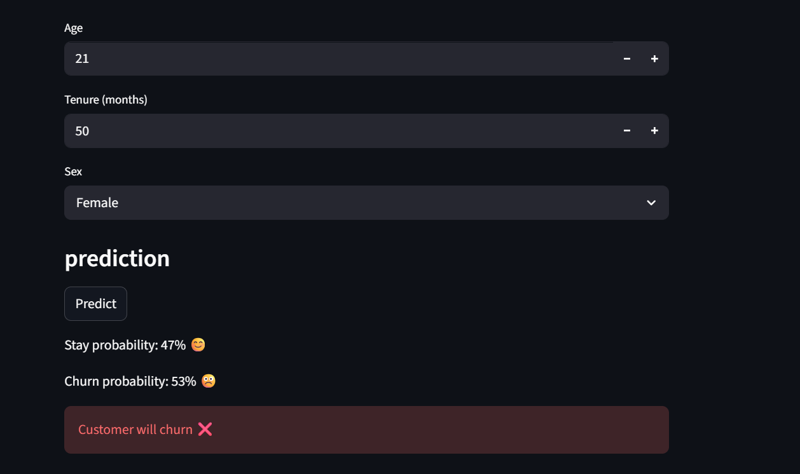

# Customer Churn Prediction App

## 📌 Project Overview

This project is a simple **Customer Churn Prediction** web application built using **Streamlit** and a trained machine learning model.
The app allows users to enter customer information and predict whether the customer is likely to churn or stay.

---

## 🚀 Features

* Preview the churn dataset
* Input customer details (Age, Tenure, Sex)
* Predict customer churn using a trained model
* Display churn and stay probabilities
* Simple and interactive Streamlit interface

---

## 🧰 Technologies Used

* Python
* Streamlit
* Pandas
* NumPy
* Joblib
* Scikit-learn (for the trained model)

---

## 📂 Project Structure

```
task/
├── Customer_Churn_PredictionAPP.py
├── churn_dataset.xlsx
├── model_Gaussian.pkl
└── README.md
```

---

## ⚙️ Installation

### 1️⃣ Clone or download the project

Navigate to the project folder:

```
cd D:\ITI\DataMinning\day2\task
```

### 2️⃣ Install required packages

```
python -m pip install streamlit pandas numpy joblib scikit-learn openpyxl
```

---

## ▶️ How to Run the App

Run the following command:

```
python -m streamlit run Customer_Churn_PredictionAPP.py
```

Then open your browser at:

```
http://localhost:8501
```

---

## 🧠 How It Works

1. The dataset is loaded and displayed.
2. The trained Gaussian model is loaded using Joblib.
3. User inputs customer information.
4. The model predicts:

   * Stay probability
   * Churn probability
5. The result is displayed in the Streamlit interface.

---

## 📊 Input Features

* **Age** — Customer age
* **Tenure** — Number of months with the company
* **Sex** — Male or Female

---

## ✅ Output

* Probability of staying
* Probability of churn
* Final prediction message

---

## 🔮 Future Improvements

* Add more customer features
* Improve UI design
* Add model performance metrics
* Deploy the app online (Streamlit Cloud)
* Add visualization charts

## Project Screenshots




⭐ *This project is part of the ITI Data Mining training tasks.*
